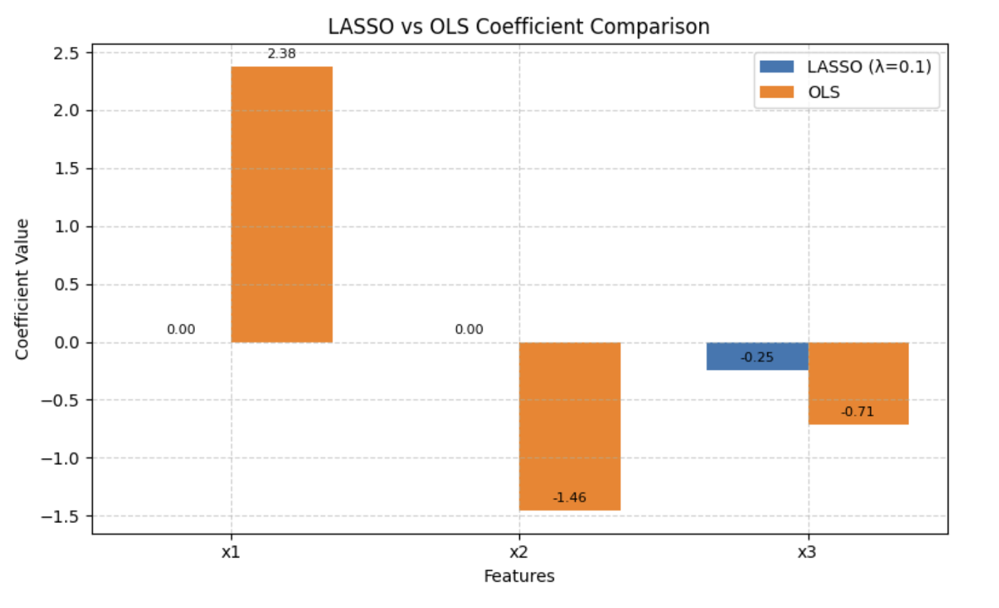
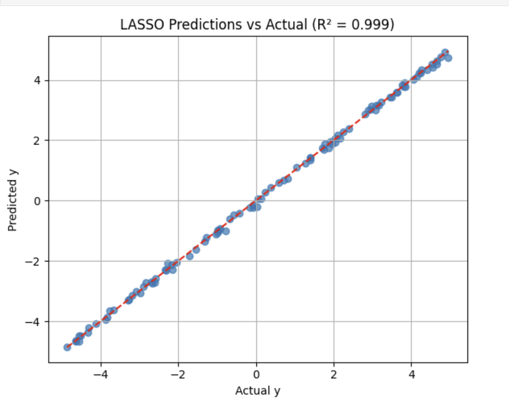
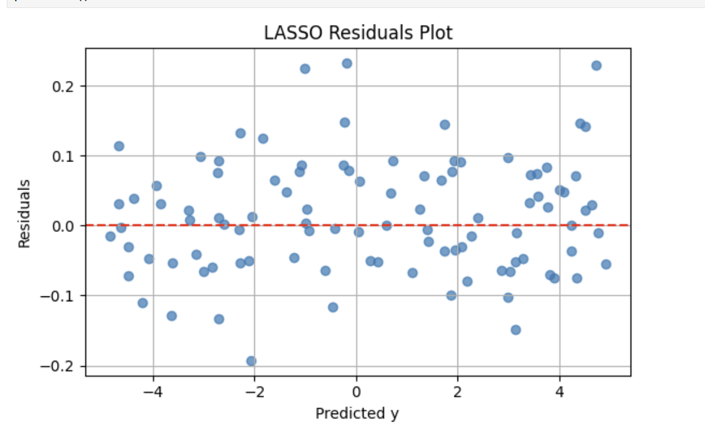

## Team Members
1. Nishant Uday Dalvi - ndalvi@hawk.iit.edu **(A20556507)** (Member 1)
2. Shriniwas Oza - soza1@hawk.iit.edu **(A20568892)** (Member 2)

## Project 1 - LASSO Regularized Regression using the Homotopy Method

## Overview
This project implements the **LASSO (Least Absolute Shrinkage and Selection Operator)** regression model via the **Homotopy method**, as outlined in [this paper](https://people.eecs.berkeley.edu/~elghaoui/Pubs/hom_lasso_NIPS08.pdf). The model was implemented from the scratch in NumPy and SciPy, focusing on first principles and with no existing LASSO implementation available in libraries such as Scikit-Learn.

The LASSO technique is very suitable for feature selection and regularized regression, particularly for the high-dimensional and collinear data. Although Scikit-Learn has been utilized, it is used **only for evaluation and comparison purposes** (e.g., for OLS baseline and computing metrics).

For robustness, the project has several test cases to check for correctness, sparsity, and generalization.

## Model Design and Implementation
- The `LassoHomotopyModel` class implements the full Homotopy algorithm with optional warm-starts, active set tracking, and residual-based updates.
- The `LassoHomotopyResults` class supports:
  - `predict()`
  - Evaluation metrics: `rmse()`, `r2_score()`, `mae()`, `correlation()`
  - Summary reporting via `summary()`
- The model handles degenerate cases gracefully: all-zero features, constant targets, and noisy datasets.

---

## Test Design and Implementation
- A dedicated file (`test_LassoHomotopy.py`) contains **10 comprehensive test cases** designed to evaluate:
  - **Correctness** of prediction
  - **Generalization** to unseen data
  - **Sparsity** under collinearity
  - **Robustness** under noise
  - **Edge Case Handling**: all-zero features, constant targets
  - **Comparative performance** against OLS

- Evaluation Metrics:
    - Included substantive measures like RMSE, R2 Score, MAE, and Pearson Correlation to give an overall model performance evaluation.

- Edge Case Handling:
    - Identified and fixed edge-case failures, making `fit()` more robust with pre-emptive handling of such cases such as zero active features.

- Model Validation Enhancements:
    - Added a `summary()` method to print test evaluation statistics for each test to facilitate transparency and readability of model-side evaluations.

---

## Visualization Notebook (Bonus)
We created a **visualization notebook** to gain insights into model behavior on collinear data.

**Highlights:**
- **LASSO vs OLS Coefficients**: Visual comparison showing LASSO’s sparsity vs OLS's full coefficients
- **Predicted vs Actual Values**: Scatter plot with R² annotation, confirming high accuracy
- **Residuals Plot**: Distribution of prediction errors (residuals) to inspect randomness and bias
- **Conclusion Section**: Discusses practical use cases for LASSO like genomics, finance, and interpretable ML

**Notebook Path:** `./LassoHomotopy/visualizations/LassoVisualization.ipynb`

**Sample Output Visuals:**




---

## Folder Structure
```
Project1/
├── LassoHomotopy/
│   ├── datasets/
│   │   ├── small_dataset.csv
│   │   ├── noisy_dataset.csv
│   │   └── collinear_dataset.csv
│   ├── model/
│   │   └── LassoHomotopy.py
│   ├── tests/
│   |   └── test_LassoHomotopy.py
|   |   └── images/
│   |       ├── 1.png
│   |       ├── 2.png
│   |       ├── 3.png
│   |       ├── 4.png
│   |       ├── 5.png
│   |       ├── 6.png
│   |       ├── 7.png
│   |       ├── 8.png
│   |       ├── 9.png
│   |       └── 10.png
│   └── visualizations/
│       ├── LassoVisualization.ipynb
│       └── images/
│           ├── lasso_vs_ols.png
│           ├── pred_vs_actual.png
│           └── residuals.png
├── README.md
└── requirements.txt
```

## How to Run

### Step 1: Create and Activate a Virtual Environment
```bash
python -m venv venv
source venv/bin/activate      # For Linux/macOS
venv\Scripts\activate         # For Windows
```

### Step 2: Install Required Packages
```bash
pip install -r requirements.txt
```

### 3. Run the tests using PyTest
```bash
pytest -s LassoHomotopy/tests/test_LassoHomotopy.py
```
The `-s` flag prints formatted output for each test.

You will see **10 test outputs**, each formatted with headers and evaluation metrics.

### Example Usage
```python
from model.LassoHomotopy import LassoHomotopyModel
import numpy as np

# Generate some sample data
X = np.random.randn(100, 5)
y = 3 * X[:, 0] - 2 * X[:, 2] + np.random.normal(0, 0.1, 100).reshape(-1, 1)

# Fit the Lasso model
model = LassoHomotopyModel(reg_param=0.1)
results = model.fit(X, y)

# Predict and evaluate
predictions = results.predict(X)
results.summary(X, y)
```

## What the Model Does
This implementation solves the LASSO regression problem using the Homotopy algorithm. It is particularly useful when:
- You expect some features to be irrelevant (it **automatically sets some coefficients to zero**)
- You have **collinear features** (standard linear regression may break down)
- You want a simple, interpretable model that avoids overfitting

## How We Tested the Model
We implemented **10 rigorous test cases** to evaluate different aspects of model performance:

| Test No. | Description |
|----------|-------------|
| Test 1   | Sanity check using professor's small dataset |
| Test 2   | Generalization check on custom small dataset (train/test split) |
| Test 3   | Sparsity on professor's collinear dataset |
| Test 4   | Sparsity on custom collinear dataset |
| Test 5   | Robustness on noisy data |
| Test 6   | All-zero input features edge case |
| Test 7   | Constant target behavior test |
| Test 8   | Compare OLS vs LASSO (collinearity) |
| Test 9   | Compare OLS vs LASSO (noise) |
| Test 10  | Compare OLS vs LASSO (constant output) |

All tests include detailed output for RMSE, R2 score, MAE, and correlation.

**Test Outputs:**


## Limitations / Known Challenges
- When **all features are zero**, we handle it gracefully by returning a zero vector (fixed).
- When the **target is constant**, the R2 score and correlation become less meaningful (returns `NaN` where applicable).
- The model **may underfit** when regularization is too strong - this is by design in LASSO.

## Answering the README Questions

### What does the model do and when should it be used?
This model solves **LASSO regularized linear regression** using the Homotopy Method. It is particularly useful when:
- We expect **sparse solutions**, i.e., only a few features contribute significantly
- Data exhibits **collinearity** (highly correlated features)
- We want **feature selection** alongside regression

### How did you test your model?
- Using **10 test cases** on small, collinear, noisy, and synthetic datasets
- Compared performance against **OLS (Ordinary Least Squares)** in specific scenarios
- Checked for expected sparsity, robustness, and behavior under edge conditions (zero input, constant targets)
- Tests included **assertions** on RMSE, R2, MAE, correlation, and coefficient behavior

### What parameters have you exposed to users?
- `reg_param`: Regularization strength
- `max_iterations`: Cap on iteration loops
- `init_coef`: Optional starting coefficients (warm start)
- `scale_mu`: Scaling factor for in homotopy formulation
- `verbose`: Enable iterative debug logs

### Are there inputs the model struggles with? Given more time, could you work around these or is it fundamental?

1. **All-Zero Input Features:**
    - When input **features are all zeros**, model exits early with zero predictions (handled safely)
    - We handle this gracefully by initializing `active_list` early and avoiding crashes.

2. **Constant Target Values:**
    - For **constant target outputs**, model underfits due to regularization (expected)
    - This is an inherent limitation of regularized models and not a bug. Our tests (`test_constant_target_output`) acknowledge and accept this.

3. **Highly Correlated Features:**
    - Although LASSO handles collinearity well, there can be instability in selecting **which** feature it retains. LASSO may pick any one of the correlated variables arbitrarily.
    - This is not a bug but a known behavior of LASSO. It does not "average" coefficients like Ridge Regression might.

4. **No Active Features Activated:**
    - In very strict regularization (`reg_param` too high), no features may be activated at all, resulting in a zero model.
    - We detect this and assign a zero vector for coefficients to avoid crashes.


## Hint Evaluation - Collinear Data
> "What should happen when you feed it highly collinear data?"

We confirmed that LASSO enforces **sparsity** and **eliminates redundant features** when data contains multicollinearity. This was explicitly tested in:
- `test_sparsity_on_professor_collinear_data`
- `test_sparsity_on_custom_collinear_data`
- `test_compare_lasso_vs_ols_collinearity`

In each case, LASSO produced significantly more zero coefficients compared to OLS.

## Final Notes
This submission includes:
- Fully implemented `LassoHomotopyModel`
- A rich test suite (`test_LassoHomotopy.py`) covering all required behaviors and edge cases
- Evaluation metrics implemented directly in the results class
